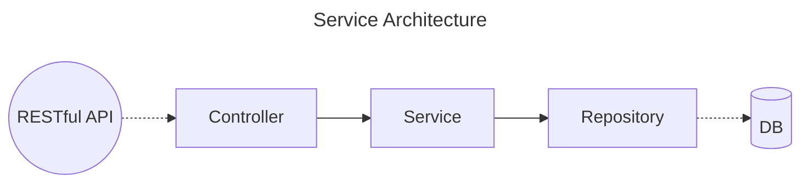

# Programs

---

## Intro

Programs is a small RESTful service using Node.js and TypeScript.

It demonstrates how a simple study program CRUD could be implemented with best practices in mind, like TDD, Clean Code and Clean Architecture.

## Usage

### Requirements

This service requires only Node.js installed.

It has been written with Node.js 18.16. It might work on older versions, however, this is not guaranteed.

### Installation

To install dependencies, simply run:

```
npm install
```

### Running

To start a service, run:

```
npm start
```

This command would compile the Typescript into a `/dist` directory and run.

The server starts on port 3000. The following message is displayed in the console:

```
Listening on port 3000
```

During development, it's possible to start the service in a monitoring mode, using `nodemon`:

```
npm run start:mon
```

The server would restart automatically on code changes.

### Running Tests

To run tests, run:

```
npm test
```

This would run the tests written with [Jest](https://jestjs.io) and display the test coverage.

### Postman Collection

Postman collections are included in the repository root, `Programs.postman_collection.json`. They may be imported to Postman to easily test the API.

## Architecture

The service has been implemented with [Inversify](https://inversify.io) as a dependency injection framework. It is powered by [inversify-express-utils](https://github.com/inversify/inversify-express-utils) to make use of [Express](https://expressjs.com) web framework for HTTP API implementation.

The code has the following classes:

-   Controllers — define HTTP API endpoints
-   Services — implement main business logic
-   Models — declare entities used by business logic
-   Repositories — represent Database storage



Additionally, the code contains Middlewares, which define logic executed before business-logic (e.g. validation) or after it (e.g. error-handling).

## API

The RESTful API exposed by the service allows the following operations:

-   listing programs
-   adding a program
-   deleting a program
-   updating a program

Input and output data has JSON format.

## Limitations

The solution also has some room for functional and technical improvements.

-   There is no port configuration
    -   It could be done by defining some env variable like `PORT` and reading from it on start
    -   A tool such as [dotenv](https://github.com/motdotla/dotenv) may be used to customize env variables locally
-   There is no Swagger documentation
    -   A tool like [tsoa](https://tsoa-community.github.io/docs/) may be used to annotate Controllers and generate Swagger from those annotations
-   The repository implementation stores data in memory, without persistance
    -   Alternative repository implementations may be added to use DBs like MongoDB, MySQL/PostgreSQL or at least save to a file
    -   In case of DB usage, tools like [TypeORM](https://typeorm.io) may be utilized to model data storage
-   There is no pre-filling of the storage with fake data
    -   However, it's relatively easy to add data using attached Postman collection
    -   Prefilling may be implemented as a script calling directly Repository
-   There are no separate DTOs on the HTTP layer
    -   Introducing those may ensure having an API contract independent from the internal models
    -   It also adds more guarantees for consuming and returning just the expected data
    -   DTOs may use a different names and casing than internal models (f.e. `field_name` vs `fieldName`)
-   There are no machine-readable error codes provided in the contract
    -   They may be added as numbers or codes like `service-name/not-found`, for example
    -   The implementation may be done by introducing a class of app errors, which would embed those codes
    -   Afterwards, those app errors would be processed on error handling middleware accordingly, returning error code in the response
-   The chosen validator ([express-validator](https://express-validator.github.io/docs)) may be substituted with a more generic solutions like [ajv](https://ajv.js.org) or [joi](https://joi.dev)
    -   This would allow covering validation process with unit tests
    -   It'd also enable reusing validation in cases, where different APIs than HTTP are exposed
-   There is no request tracking and logging implemented
    -   It could be done by generating request ID at the start of each request handling and putting it to [AsyncLocalStorage](https://nodejs.org/api/async_context.html#class-asynclocalstorage)
    -   Afterwards, this request ID may be added to every internal log, as well as request logs
    -   This allows easier debugging and analysis of requests, especially if they are collected in tools like Kibana
-   Some parts of code are not covered with tests
    -   The middleware for checking validation errors and forming respective responses is not covered with tests
    -   Some glue code on server launch is not covered with tests
-   Commit history uses just `main` branch
    -   In real project with multiple developers, a better approach is to have separate feature branches with names corresponding to the tickets in an issue tracker
    -   Commits should also contain the issue number or ID for easier connection of code changes with the tickets and their details

## Tooling

Tooling used in the solution include:

-   [Inversify](https://inversify.io) and [inversify-express-utils](https://github.com/inversify/inversify-express-utils) for dependency injection and API definition
-   [body-parser](https://github.com/expressjs/body-parser) and [express-validator](https://express-validator.github.io/docs) for parsing and validating API inputs
-   [http-errors](https://github.com/jshttp/http-errors) for error management
-   [Jest](https://jestjs.io) and [ts-jest](https://github.com/kulshekhar/ts-jest) for unit-testing
-   [ts-mockery](https://github.com/ike18t/ts-mockery) for mocking classes in tests
-   [Faker](https://fakerjs.dev) for generating random test data
-   [prettier](https://prettier.io) for code formatting
-   [eslint](https://eslint.org) and [typescript-eslint](https://typescript-eslint.io) for code linting
